# GitLab Development Workflow for AXIS Surveillance System

## Overview
This document outlines the development workflow for the three technical teams working on the AXIS Surveillance System in a GitLab environment.

## Team Structure
- **Frontend Team**: Vue interface, API gateway, authentication
- **Communications Team**: Camera integration, RTSP streams, ONVIF/VAPIX protocols
- **Intelligence Team**: AI/ML detection, analytics, cross-camera tracking

## Contract-First Development Workflow

### 1. Contract Design Phase
**Location**: `shared/contracts/`

```bash
# Team lead proposes API change
git checkout -b feature/api-camera-detection
cd shared/contracts/

# Edit OpenAPI specification
vim camera-api.yaml

# Validate contract
make validate

# Commit and push
git add .
git commit -m "feat: Add detection endpoint to camera API"
git push -u origin feature/api-camera-detection
```

### 2. Merge Request & Review
**GitLab Process**:
1. Create MR targeting `main`
2. Assign reviewers from affected teams
3. Use GitLab discussions for contract negotiation
4. Require approval from each team lead

**Review Checklist**:
- [ ] Breaking changes identified
- [ ] Version bump if needed
- [ ] All teams agree on contract
- [ ] Documentation updated

### 3. Code Generation
**After MR Approval**:

```bash
# Pull approved changes
git checkout main
git pull origin main

# Generate models and clients
cd shared/
make generate

# Package for distribution
make package-shared
```

### 4. Team Implementation Phase

#### Frontend Team Workflow
```bash
# Create feature branch
git checkout -b feature/detection-ui

# Install updated shared package
cd interface/
npm install ../shared/axis-shared-*.tgz

# Implement using generated types
# TypeScript ensures contract compliance
npm run dev

# Run tests
npm test
npm run lint
npm run type-check
```

#### Communications Team Workflow
```bash
# Create feature branch
git checkout -b feature/camera-detection

# Update dependencies
cd communication/
pip install -e ../shared/

# Import generated models
# from axis_shared.models.communications import Detection

# Run tests
pytest tests/
ruff check .
mypy .
```

#### Intelligence Team Workflow
```bash
# Create feature branch
git checkout -b feature/ml-detection

# Update dependencies
cd intelligence/
pip install -e ../shared/

# Use type-safe models
# from axis_shared.models.shared import Detection

# Validate implementation
pytest tests/
black .
mypy .
```

### 5. Integration Testing

```bash
# Start all services with docker-compose
docker-compose up -d

# Run contract tests
cd shared/
make test-contracts

# Run end-to-end tests
make e2e-test
```

### 6. CI/CD Pipeline

**.gitlab-ci.yml Structure**:

```yaml
stages:
  - validate
  - generate
  - test
  - build
  - deploy

validate-contracts:
  stage: validate
  script:
    - cd shared/
    - make validate
  only:
    changes:
      - shared/contracts/**/*.yaml

generate-code:
  stage: generate
  script:
    - cd shared/
    - make generate
    - make package-shared
  artifacts:
    paths:
      - shared/generated/
      - shared/axis-shared-*.tgz

test-frontend:
  stage: test
  script:
    - cd interface/
    - npm ci
    - npm test
    - npm run lint

test-communications:
  stage: test
  script:
    - cd communication/
    - pip install -e ../shared/
    - pytest
    - ruff check .

test-intelligence:
  stage: test
  script:
    - cd intelligence/
    - pip install -e ../shared/
    - pytest
    - mypy .
```

## Daily Workflow

### Morning Sync
1. **GitLab Board Review**: Check assigned issues
2. **MR Status**: Review pending merge requests
3. **Contract Changes**: Discuss any API modifications

### Development Cycle
1. **Pull latest main**: `git pull origin main`
2. **Create feature branch**: `git checkout -b feature/AXIS-123-description`
3. **Regular commits**: Use conventional commits
   - `feat:` New feature
   - `fix:` Bug fix
   - `docs:` Documentation
   - `refactor:` Code refactoring
   - `test:` Test additions
4. **Push and create MR**: Include issue reference

### Code Review Process
1. **Self-review**: Check diff before requesting review
2. **Assign reviewers**: At least one from your team
3. **Address feedback**: Push fixes as new commits
4. **Squash on merge**: Clean commit history

## Cross-Team Branching Strategy

### The Contract-First Challenge
With contract-first development, features often require coordination across multiple teams. A single user feature might need:
1. Contract definition (shared)
2. Frontend implementation
3. Backend service implementation (Communications/Intelligence)
4. Integration and testing

### Branching Hierarchy for Cross-Team Features

```
main
├── contract/AXIS-100-detection-feature     # Contract definition (MUST merge first)
│   └── After contract merges, teams branch from main:
├── feature/AXIS-100-frontend-ui           # Frontend implementation
├── feature/AXIS-100-comms-integration     # Communications implementation
├── feature/AXIS-100-intel-processing      # Intelligence implementation
└── integration/AXIS-100-detection         # Integration testing branch
```

### Branch Types & Ownership

| Branch Type | Pattern | Owner | Merge Order | Blocks |
|------------|---------|-------|-------------|--------|
| Contract | `contract/AXIS-{epic}-description` | Lead team | 1st | All implementation |
| Feature | `feature/AXIS-{issue}-{team}-description` | Single team | 2nd | Integration |
| Integration | `integration/AXIS-{epic}-description` | Cross-team | 3rd | Release |
| Hotfix | `hotfix/critical-description` | Any team | Immediate | Nothing |

### Merge Order Rules


**Critical Rules:**
1. **Contract First**: Contract branches MUST be merged before implementation begins
2. **Code Generation**: After contract merge, regenerate and distribute shared code
3. **Parallel Implementation**: Teams work in parallel after contract approval
4. **Integration Last**: Integration branch created only after all team branches merge

### Branch Dependencies Example

```yaml
# Epic: AXIS-100 - Add Person Detection with Audio Alerts
dependencies:
  contract:
    branch: contract/AXIS-100-detection-audio
    blocks: [AXIS-101, AXIS-102, AXIS-103]

  implementations:
    - branch: feature/AXIS-101-frontend-detection-ui
      team: frontend
      depends_on: contract/AXIS-100

    - branch: feature/AXIS-102-comms-audio-control
      team: communications
      depends_on: contract/AXIS-100

    - branch: feature/AXIS-103-intel-person-detection
      team: intelligence
      depends_on: contract/AXIS-100

  integration:
    branch: integration/AXIS-100-full-feature
    depends_on: [AXIS-101, AXIS-102, AXIS-103]
```

## Cross-Team Issue Board Management

### Issue Hierarchy for Cross-Team Features

```
Epic (Cross-Team Feature)
├── Contract Issue (Blocks all)
├── Team Implementation Issues
│   ├── Frontend Issue
│   ├── Communications Issue
│   └── Intelligence Issue
└── Integration Issue (Depends on all)
```

### Board Structure

#### Main Board Columns
| Column | Purpose | Issue Types | Who Moves |
|--------|---------|------------|-----------|
| **Backlog** | Unstarted work | All | Product Manager |
| **Contract Design** | API specification work | Contract issues | Lead Developer |
| **In Contract Review** | Contract MR under review | Contract issues | Reviewers |
| **Ready for Implementation** | Contract merged, awaiting dev | Team issues | Team Leads |
| **In Development** | Active implementation | Team issues | Developers |
| **In Review** | Implementation MR review | Team issues | Reviewers |
| **Integration Testing** | Cross-team testing | Integration issues | QA Team |
| **Done** | Fully integrated & tested | All | QA Lead |

### Issue States & Movement


### When to Mark Issues as Done

#### Contract Issues - Done When:
- [x] OpenAPI spec reviewed and approved by all teams
- [x] Contract merged to main
- [x] Code generated successfully
- [x] Shared package published
- [x] All teams have access to generated code

#### Team Implementation Issues - Done When:
- [x] Implementation complete using generated contracts
- [x] Unit tests passing (>80% coverage)
- [x] Integration tests with mocked services passing
- [x] Code review approved
- [x] Merged to main
- [x] No blocking bugs in team's scope

#### Integration Issues - Done When:
- [x] All team implementations merged
- [x] End-to-end tests passing
- [x] Performance requirements met
- [x] Cross-team integration verified
- [x] Documentation updated
- [x] Demo to stakeholders successful

#### Epic - Done When:
- [x] All child issues closed
- [x] Feature working in staging environment
- [x] Acceptance criteria met
- [x] Product owner sign-off received

### Labels for Cross-Team Coordination

```yaml
# Issue Type Labels
- epic                    # Parent cross-team feature
- contract               # API specification work
- implementation         # Team-specific work
- integration           # Cross-team testing

# Team Labels
- team:frontend
- team:communications
- team:intelligence
- team:all              # Requires all teams

# Status Labels
- blocked:contract      # Waiting for contract approval
- blocked:dependency    # Waiting for another team
- blocked:integration   # Waiting for integration testing
- ready-for-dev        # Contract approved, can implement

# Priority Labels
- priority:critical     # Blocks multiple teams
- priority:high        # Blocks single team
- priority:medium      # Normal workflow
- priority:low         # Nice to have
```

### GitLab Board Configuration

#### Board Lists Setup
```
1. Open (no label)
2. Contract Design (label: contract)
3. Blocked (label: blocked:*)
4. Frontend Dev (label: team:frontend)
5. Comms Dev (label: team:communications)
6. Intel Dev (label: team:intelligence)
7. Integration (label: integration)
8. Closed
```

#### Milestone Usage
- **Sprint Milestones**: 2-week sprints for implementation work
- **Contract Milestones**: 1-week cycles for API design
- **Release Milestones**: Monthly for integrated features

### Issue Management

### Issue Templates

#### Epic Template
```markdown
## Epic: [Feature Name]

### Business Value
[Why this feature matters]

### User Story
As a [user type], I want [capability] so that [benefit]

### Acceptance Criteria
- [ ] Criterion 1
- [ ] Criterion 2

### Technical Breakdown
- **Contract Changes**: [Required API modifications]
- **Frontend Work**: [UI/UX requirements]
- **Communications Work**: [Device integration needs]
- **Intelligence Work**: [ML/Analytics requirements]

### Dependencies
- External APIs: [List any]
- Hardware: [Camera/speaker requirements]
- Performance: [Latency/throughput needs]

### Sub-Issues
- [ ] #101 - Contract: Define API
- [ ] #102 - Frontend: Implement UI
- [ ] #103 - Comms: Device integration
- [ ] #104 - Intel: ML processing
- [ ] #105 - Integration: E2E testing
```

#### Contract Issue Template
```markdown
## Contract: [API Change Description]

### Affected Services
- [ ] Frontend
- [ ] Communications
- [ ] Intelligence

### Proposed Changes
```yaml
# OpenAPI spec changes here
```

### Breaking Changes
- [ ] None
- [ ] List breaking changes...

### Review Checklist
- [ ] All teams reviewed
- [ ] Backward compatibility considered
- [ ] Version bump if needed
- [ ] Documentation updated
```

### Labels
- `team:frontend`
- `team:communications`
- `team:intelligence`
- `priority:high/medium/low`
- `type:bug/feature/task`
- `contract-change`

## Definition of Done for Cross-Team Features

### The Multi-Layer Definition of Done

In a contract-first, multi-team environment, "Done" has different meanings at different stages:


### 1. Contract Definition of Done

**A contract is DONE when:**

| Criterion | Verification | Responsible |
|-----------|--------------|-------------|
| API specification complete | OpenAPI valid, examples included | Contract Owner |
| All teams reviewed | 3/3 team leads approved | Team Leads |
| Breaking changes documented | CHANGELOG updated | Contract Owner |
| Contract tests written | Postman/contract tests ready | QA Team |
| Code generation successful | `make generate` passes | CI/CD |
| Shared package published | npm/pip package available | CI/CD |

**Contract NOT done if:**
- Any team has unresolved concerns
- Generated code has compilation errors
- Missing error response definitions
- No example requests/responses

### 2. Team Implementation Definition of Done

**Team implementation is DONE when:**

| Criterion | Frontend | Communications | Intelligence |
|-----------|----------|---------------|--------------|
| **Functional** | UI renders correctly | Camera integration works | ML model integrated |
| **Contract Compliance** | TypeScript types match | Pydantic models used | API responses valid |
| **Unit Tests** | >80% coverage, Vitest passes | >80% coverage, pytest passes | >80% coverage, pytest passes |
| **Integration Tests** | Mock API tests pass | Mock camera tests pass | Mock detection tests pass |
| **Code Quality** | ESLint clean | Ruff/Black/MyPy clean | Ruff/Black/MyPy clean |
| **Documentation** | Component docs updated | Service docs updated | Algorithm docs updated |
| **Performance** | <100ms render time | <2s camera connect | <100ms detection |
| **Code Review** | 2 approvals | 2 approvals | 2 approvals |
| **Merged to Main** | ✅ | ✅ | ✅ |

**Team implementation NOT done if:**
- Using old contract version
- Mocked functionality remains
- Known bugs exist
- Performance requirements not met

### 3. Integration Definition of Done

**Integration is DONE when:**

```yaml
integration_done_checklist:
  cross_team_testing:
    - [ ] All services running together
    - [ ] End-to-end test suite passes
    - [ ] No integration bugs blocking features

  performance:
    - [ ] Full pipeline latency <2 seconds
    - [ ] 10 concurrent users supported
    - [ ] Memory usage stable over 24 hours

  data_flow:
    - [ ] Camera → Detection → UI works
    - [ ] Events propagate correctly
    - [ ] Error handling across services verified

  compatibility:
    - [ ] All services using same contract version
    - [ ] Database migrations applied
    - [ ] Configuration synchronized
```

### 4. Feature Definition of Done

**A complete feature is DONE when:**

| Stage | Criteria | Verification Method |
|-------|----------|-------------------|
| **Acceptance** | All acceptance criteria met | Product Owner review |
| **User Testing** | UAT feedback addressed | User sign-off |
| **Documentation** | User guide updated | Doc review complete |
| **Demo** | Stakeholder demo successful | Meeting minutes |
| **Monitoring** | Metrics/alerts configured | Grafana dashboard live |
| **Rollback Plan** | Can revert if needed | Tested procedure |

### 5. When to Close Issues

#### Close Contract Issue When:
```markdown
- [x] Merged to main
- [x] Generated code distributed
- [x] All team issues created
- [x] No blocking feedback
```

#### Close Team Issue When:
```markdown
- [x] Implementation complete
- [x] Tests passing in CI
- [x] Merged to main
- [x] No critical bugs
- [x] Integration issue created (if needed)
```

#### Close Integration Issue When:
```markdown
- [x] All team implementations merged
- [x] E2E tests passing
- [x] Performance validated
- [x] Deployed to staging
```

#### Close Epic When:
```markdown
- [x] All sub-issues closed
- [x] Feature in production
- [x] Metrics show success
- [x] Retrospective complete
```

### Common "Not Done" Scenarios

#### Scenario 1: Contract Changed After Implementation Started
```
Status: NOT DONE - Restart from contract phase
Action: Create new contract issue, invalidate team work
Impact: 2-3 day delay minimum
```

#### Scenario 2: Team A Done, Team B Blocked
```
Status: Team A DONE, Feature NOT DONE
Action: Team A can start next feature
Impact: Integration delayed until all teams complete
```

#### Scenario 3: Integration Tests Fail
```
Status: Teams DONE, Integration NOT DONE
Action: Create bug issues per team
Impact: Teams must fix in current sprint
```

### Done vs Deployed

**Important Distinction:**
- **Done** = Ready for production, all criteria met
- **Deployed** = Actually running in production


## Cross-Team Coordination Workflows

### Weekly Cross-Team Ceremonies

#### Monday: Contract Planning (30 min)
```markdown
Attendees: Team Leads, Product Manager
Agenda:
1. Review upcoming features needing contracts
2. Assign contract owners
3. Set contract review deadlines
4. Identify blocking dependencies

Output: Contract backlog prioritized
```

#### Wednesday: Integration Sync (30 min)
```markdown
Attendees: All developers
Agenda:
1. Status of in-flight features
2. Blocking issues between teams
3. Integration test results
4. Coordinate integration branches

Output: Unblocked teams, integration plan
```

#### Friday: Demo & Retrospective (1 hour)
```markdown
Attendees: Full team + stakeholders
Agenda:
1. Demo completed features
2. Review "done" criteria achievements
3. Discuss process improvements
4. Celebrate successes

Output: Feedback incorporated, process refined
```

### Feature Kickoff Process


### Dependency Management

#### Blocking Dependency Protocol
1. **Identify** - Team recognizes blocker
2. **Communicate** - Post in #blocked Slack channel
3. **Escalate** - Tag blocking team lead
4. **Track** - Add `blocked:` label in GitLab
5. **Resolve** - Blocking team prioritizes
6. **Unblock** - Remove label, notify waiting team

#### Dependency Matrix Example
```yaml
Feature: Person Detection with Audio Alerts
Dependencies:
  frontend:
    needs: [contract, intelligence_api]
    blocks: [user_testing]

  communications:
    needs: [contract, hardware_access]
    blocks: [intelligence, integration]

  intelligence:
    needs: [contract, camera_feed]
    blocks: [frontend, integration]

  integration:
    needs: [all_teams]
    blocks: [release]
```

### Conflict Resolution

#### Contract Conflicts
```markdown
Scenario: Teams disagree on API design
Resolution Path:
1. Each team documents their requirements
2. Architecture review meeting scheduled
3. System Architect makes final decision
4. Decision documented in ADR
5. Contract updated and frozen
```

#### Resource Conflicts
```markdown
Scenario: Multiple teams need same test environment
Resolution Path:
1. QA team maintains environment calendar
2. Teams book time slots in advance
3. Parallel environments for critical paths
4. Automated environment reset between teams
```

## Deployment Workflow

### Staging Deployment
```bash
# Triggered automatically on main branch
git checkout main
git pull origin main
git tag v1.2.0-rc1
git push origin v1.2.0-rc1
```

### Production Deployment
```bash
# After staging validation
git tag v1.2.0
git push origin v1.2.0
# GitLab CI/CD handles deployment
```

## Troubleshooting Common Issues

### Contract Mismatch
```bash
# Regenerate from latest contracts
cd shared/
make clean
make generate
make package-shared
```

### Merge Conflicts in Contracts
```bash
# Always regenerate after resolving
git merge main
# Resolve conflicts in YAML files
make validate
make generate
git add .
git commit
```

### Failed Pipeline
1. Check GitLab CI logs
2. Run tests locally
3. Verify contract compliance
4. Check for missing dependencies

## Best Practices

1. **Never skip contract validation**
2. **Always use generated models**
3. **Commit generated code separately**
4. **Tag releases consistently**
5. **Document breaking changes**
6. **Keep MRs focused and small**
7. **Test locally before pushing**
8. **Use GitLab issues for tracking**

## Real-World Case Study: Person Detection with Audio Alerts

### Feature Overview
**Epic**: AXIS-100 - Detect persons entering restricted zones and trigger audio warnings

**Teams Involved**: All three teams (Frontend, Communications, Intelligence)

**Timeline**: 3 sprints (6 weeks total)

### Sprint 1: Contract Phase (Week 1-2)

#### Day 1-3: Requirements & Design
```markdown
GitLab Epic Created: AXIS-100
Sub-Issues Created:
- AXIS-100-C: Contract definition
- AXIS-101: Frontend UI for zone configuration
- AXIS-102: Communications speaker control
- AXIS-103: Intelligence person detection
- AXIS-104: Integration testing
```

#### Day 4-7: Contract Development
```yaml
# contract/AXIS-100-detection-audio branch created
# OpenAPI additions:

/api/v1/zones:
  post:
    summary: Create restricted zone
    requestBody:
      content:
        application/json:
          schema:
            $ref: '#/components/schemas/Zone'

/api/v1/detections:
  post:
    summary: Report person detection
    requestBody:
      content:
        application/json:
          schema:
            $ref: '#/components/schemas/Detection'

/api/v1/alerts/audio:
  post:
    summary: Trigger audio alert
    requestBody:
      content:
        application/json:
          schema:
            $ref: '#/components/schemas/AudioAlert'
```

#### Day 8-10: Contract Review
```markdown
MR #45: Contract for person detection with audio
Reviews:
- Frontend: "Need websocket events for real-time UI updates" ✅
- Communications: "Add speaker_id field for multi-speaker support" ✅
- Intelligence: "Include confidence_threshold in Detection" ✅

Contract Updated → All teams approve → Merged to main
```

#### Day 11: Code Generation
```bash
cd shared/
make generate
# Generated:
# - TypeScript interfaces for Frontend
# - Pydantic models for Python services
# - HTTP clients for service communication

make package-shared
# Published: axis-shared-1.2.0
```

### Sprint 2: Implementation Phase (Week 3-4)

#### Team Branches Created
```bash
# All teams pull latest main with contract
git checkout main && git pull

# Each team creates implementation branch
git checkout -b feature/AXIS-101-frontend-zones      # Frontend
git checkout -b feature/AXIS-102-comms-speaker       # Communications
git checkout -b feature/AXIS-103-intel-detection     # Intelligence
```

#### Frontend Team Progress
```typescript
// Day 12-15: Zone configuration UI
import { Zone, Detection } from '@axis-shared/models';

const ZoneEditor = () => {
  // Implementation using generated types
  const createZone = async (zone: Zone) => {
    await apiClient.zones.create(zone);
  };
};

// Day 16-18: Real-time detection display
const DetectionMonitor = () => {
  useWebSocket('/ws/detections', (detection: Detection) => {
    // Update UI with type-safe detection data
  });
};
```

**Issue Status**: AXIS-101 moved to "In Review"

#### Communications Team Progress
```python
# Day 12-15: Speaker integration
from axis_shared.models.communications import AudioAlert, Speaker
from axis_vapix import SpeakerClient

async def trigger_audio_alert(alert: AudioAlert):
    speaker = await get_speaker(alert.speaker_id)
    await speaker.play_audio(alert.audio_file)

# Day 16-18: Test with physical speakers
# Issue found: Network latency > 500ms
# Solution: Pre-load common audio files
```

**Issue Status**: AXIS-102 in "In Development" (fixing latency)

#### Intelligence Team Progress
```python
# Day 12-15: Person detection pipeline
from axis_shared.models.shared import Detection, Zone
import cv2

async def process_frame(frame: np.ndarray, zone: Zone) -> Optional[Detection]:
    persons = detect_persons(frame)  # ML model
    for person in persons:
        if is_in_zone(person.bbox, zone.coordinates):
            return Detection(
                type="person",
                confidence=person.confidence,
                zone_id=zone.id,
                timestamp=datetime.now()
            )
```

**Issue Status**: AXIS-103 moved to "In Review"

### Sprint 3: Integration Phase (Week 5-6)

#### Day 19-21: Team Implementation Complete
```markdown
GitLab Board Status:
- AXIS-101 (Frontend): ✅ Merged to main
- AXIS-102 (Communications): ✅ Merged to main (latency fixed)
- AXIS-103 (Intelligence): ✅ Merged to main
- AXIS-104 (Integration): Started
```

#### Day 22-24: Integration Testing
```bash
# integration/AXIS-100-full-feature branch created
docker-compose up -d  # All services running

# Integration test results:
✅ Person enters zone → Detection triggered
❌ Audio plays → 3-second delay (requirement: <2s)
✅ UI updates → Real-time display working
❌ Multiple zones → Detections mixed up
```

**Issues Created**:
- AXIS-105: Fix audio delay (Communications)
- AXIS-106: Fix zone correlation (Intelligence)

#### Day 25-27: Bug Fixes
```markdown
Teams create bugfix branches:
- bugfix/AXIS-105-audio-delay
- bugfix/AXIS-106-zone-correlation

Fixes implemented and merged
Integration tests rerun: ✅ All passing
```

#### Day 28-30: Final Integration
```yaml
Final Test Results:
  Functional:
    - Person detection: ✅ Working
    - Audio alerts: ✅ <2s latency
    - Multi-zone support: ✅ Correct correlation
    - UI real-time updates: ✅ WebSocket stable

  Performance:
    - Detection latency: 87ms (requirement: <100ms) ✅
    - Audio response: 1.3s (requirement: <2s) ✅
    - Concurrent zones: 10 (requirement: 5+) ✅

  Integration:
    - E2E tests: 45/45 passing ✅
    - Load test: 20 users stable ✅
```

### Issue Closure Timeline

```mermaid
gantt
    title Issue Lifecycle for AXIS-100
    dateFormat  DD
    section Contract
    AXIS-100-C Contract    :done, 01, 10
    section Frontend
    AXIS-101 UI            :done, 11, 18
    section Communications
    AXIS-102 Speaker       :done, 11, 19
    AXIS-105 Bug Fix       :done, 25, 26
    section Intelligence
    AXIS-103 Detection     :done, 11, 18
    AXIS-106 Bug Fix       :done, 25, 26
    section Integration
    AXIS-104 Testing       :done, 19, 30
    section Epic
    AXIS-100 Complete      :done, 01, 30
```



### Lessons Learned

#### What Worked Well
1. **Contract-first approach** prevented integration issues
2. **Parallel development** after contract approval saved time
3. **Generated types** caught errors at compile time
4. **Clear DoD** prevented premature issue closure

#### Challenges Faced
1. **Hardware testing** (speakers) delayed Communications team
2. **Contract changes** during review added 2 days
3. **Integration bugs** required cross-team debugging

#### Process Improvements
1. **Earlier hardware access** for testing
2. **Contract freeze period** after approval
3. **Shared test environment** booking system
4. **Cross-team pairing** for integration bugs

### Final Metrics

| Metric | Target | Actual | Status |
|--------|--------|--------|--------|
| Sprint Velocity | 15 points | 18 points | ✅ |
| Contract → Feature | 6 weeks | 6 weeks | ✅ |
| Bug Rate | <5 | 2 | ✅ |
| Test Coverage | >80% | 87% | ✅ |
| Team Coordination | Good | Excellent | ✅ |

### Key Takeaways for Workshop

1. **Contract changes are expensive** - Get it right before implementation
2. **Teams can work in parallel** - But only after contract is stable
3. **Integration issues are inevitable** - Plan time for them
4. **Clear DoD prevents confusion** - Everyone knows when they're done
5. **Communication is critical** - Daily standups, Slack, GitLab comments

## Resources
- [GitLab Documentation](https://docs.gitlab.com)
- [OpenAPI Specification](https://swagger.io/specification/)
- [Contract Testing Guide](../shared/docs/testing-guide.md)
- Team Slack channels for quick questions