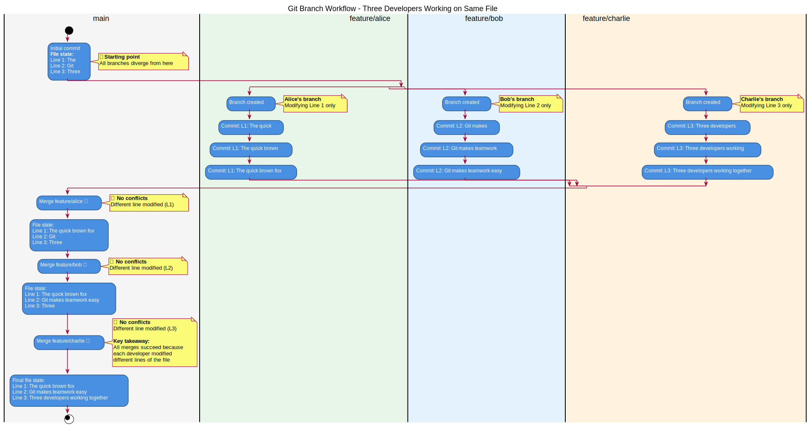

# Git Workflow Guide

**Author:** Nils Wickman (1.0 done by David Berntsson)
**Date:** October 1, 2025
**Version:** 2.0

## Table of Contents

1. [Making Changes and Committing](#1-making-changes-and-committing)
   1. [Check Status](#11-check-status)
   2. [Add Files to Commit](#12-add-files-to-commit)
   3. [Commit Changes](#13-commit-changes)
   4. [Push Changes](#14-push-changes)
2. [Keeping Your Branch Up to Date](#2-keeping-your-branch-up-to-date)
   1. [Pull Latest Changes](#21-pull-latest-changes)
3. [Merge Conflicts](#3-merge-conflicts)
   1. [When Merges Succeed Without Conflicts](#31-when-merges-succeed-without-conflicts)
   2. [Resolving Conflicts When They Occur](#32-resolving-conflicts-when-they-occur)
4. [Merge vs Rebase](#4-merge-vs-rebase)
   1. [What's the Difference?](#41-whats-the-difference)
   2. [Best Practice](#42-best-practice)
5. [Summary of Common Commands](#5-summary-of-common-commands)
6. [Additional Resources](#6-additional-resources)

## 1. Making Changes and Committing

### 1.1 Check Status

Make some changes in your files. Once you are done, you need to add the changed files to the commit. You can do all this in your IDE's (vscode, cursor, etc) but we documentation will be in terminal. 

Lets see our new git status:

```bash
git status
```

All the files that you haven't added to the commit yet are red and the ones you've added are green.

### 1.2 Add Files to Commit

If you want to add all the red files, either of the following commands work:

```bash
# Stages all files
git add *
git add -A
git add .
# Stages a specific file
git add file-folder/my-changed-file.txt
```
### 1.3 Commit Changes

After adding the file or files, running `git status` again should show the files as green which means that they will be part of the commit. To commit the files:

```bash
git commit -m "<message>"
```

The `-m` flag means that you will add a message to the commit which is required by git.

#### 1.3.1 Semantic Commit Messages

The message itself should describe what the commit is about. 
```bash
git commit -m "profile picture functionality in settings page"
```

Ask Your Lead devs how strict they are:
```bash
We use the following commit semantics for structure:

**Format:** `<type>(<scope>): <subject>`

**Types:**
- `feat`: new feature for the user, not a new feature for build script
- `fix`: bug fix for the user, not a fix to a build script
- `docs`: changes to the documentation
- `style`: formatting, missing semi colons, etc; no production code change
- `refactor`: refactoring production code, e.g. renaming a variable
- `test`: adding missing tests, refactoring tests; no production code change
- `chore`: updating grunt tasks etc; no production code change

**Guidelines:**
- The title of the commit should be no more than 50 characters
- Any lines below the title should also not be too long, roughly around 72 characters
```
#### 1.3.2 Multi-line Commit Messages

For example, a commit message could look like the following:

```bash
git commit -m "feat: Add user profile picture upload

Users can now upload profile pictures via the settings page.
Supported formats are PNG, JPEG, and WebP."
```

### 1.4 Push Changes

To push the added commit to the remote repository, simply run:

```bash
git push
```

If you go back to the website and navigate to your branch, you should see that it has the commit you just pushed and that the files have been modified.

## 2. Keeping Your Branch Up to Date

Now, while working on a feature in a branch, the main branch might have received new commits. This means that the branch you're currently working on is no longer built on top of the main branch (i.e., they have different commit histories).

### 2.1 Pull Latest Changes

To obtain the new commits from the remote repository, first switch to the development branch:

```bash
git checkout development
```

Then pull the latest changes:

```bash
git pull
```

This is the opposite of `git push`. It will pull the commits from the remote branch and merge the changes into your local copy of the branch.

Note that this will rebase your branch onto your local copy of the main branch, so make sure you've pulled the latest changes first.

## 3. Merge Conflicts

A major fear of people working with Git is dealing with merge conflicts. A merge conflict usually occurs because two different commits from two different branches have modified the same line in a file. Git is unable to resolve this on its own, and therefore it leads to a merge conflict that the developer performing the merge or rebase will have to resolve.

### 3.1 When Merges Succeed Without Conflicts

To understand when conflicts occur, let's first look at when they don't. The diagram below shows three developers working on the same file simultaneously, but each modifying different lines:



In this example, all merges succeed because:
- Alice modified Line 1
- Bob modified Line 2
- Charlie modified Line 3

Since each developer worked on different parts of the file, Git can automatically merge all changes without conflicts.

### 3.2 Resolving Conflicts When They Occur

If you encounter a merge conflict, you can either try to resolve it on your own, or you can get in touch with your lead developer who hopefully has experience dealing with them. If you're resolving it on your own, an editor such as VSCode can be used to deal with a merge conflict in an easier manner than doing it in a simple text editor such as notepad on Windows.

**Important:** Always be careful when solving a merge conflict because either one of the modifications should be kept or both in some cases.

## 4. Merge vs Rebase

### 4.1 What's the Difference?

**Rebase** takes your commits and replays them on top of another branch, creating a linear history. This keeps the commit history clean - instead of branching paths back and forth for all feature branches being merged into the main branch, you get a singular line of commits.

**Merge** creates a new merge commit that ties together the histories of both branches, preserving the branching structure.

### 4.2 Best Practice

Generally, you want to do rebases because it keeps the commit history clean. Then when you want to bring a feature branch into main, you do it through a pull request (or merge request as it's called on GitLab) which will handle things automatically for you. It's done this way since merges into main first need to be approved by appropriate people.

## 5. Summary of Common Commands

```bash
# Check current status
git status

# Add files to staging
git add <file>
git add *
git add -A
git add .

# Commit changes
git commit -m "<message>"

# Push changes to remote
git push

# Pull latest changes
git pull

# Switch branches
git checkout <branch>
git switch <branch>

# Delete local branch
git branch -D <branch>

# Rebase current branch onto another
git rebase <branch>

```

## 6. Additional Resources

- For initial setup and SSH configuration, see `../setup/README.md`
- For cross-team branching rules and coordination, see `../project_management/workflow/team-coordination.md`
- For daily workflow routines, see `../project_management/workflow/daily-basics.md`
