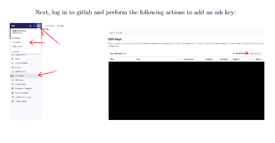
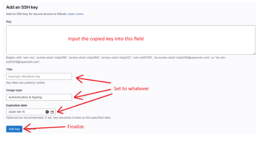
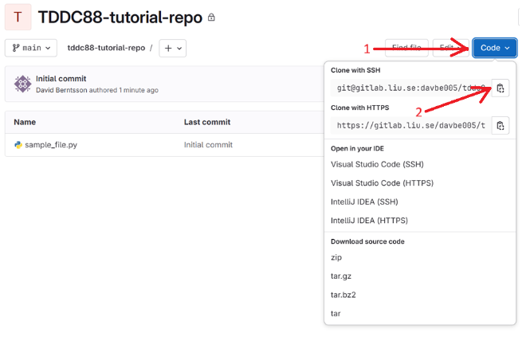

# Setup

**Author:** Nils Wickman
**Date:** October 1, 2025
**Version:** 1.0

## Table of Contents

1. [Introduction](#1-introduction)
2. [SSH Key Setup](#2-ssh-key-setup)
   1. [Generate SSH Key](#21-generate-ssh-key)
   2. [Copy Your Public Key](#22-copy-your-public-key)
   3. [Add SSH Key to GitLab](#23-add-ssh-key-to-gitlab)
3. [Cloning a Repository](#3-cloning-a-repository)
4. [Working with Branches](#4-working-with-branches)
   1. [Create a New Branch](#41-create-a-new-branch)
   2. [Push Branch to Remote](#42-push-branch-to-remote)
5. [Summary of Setup Commands](#5-summary-of-setup-commands)
6. [Next Steps](#6-next-steps)
7. [Additional Resources](#7-additional-resources)

## 1. Introduction

When working in a project, it's important to have a version control system (Git) in case things break and you want to roll back to an earlier stage of development, as well as an online backup (GitHub/GitLab) in case you lose your local copy of the project. Furthermore, if you're working in a team, a version control system is vital to make the collaboration as seamless as possible.

### 1.1 Prerequisites: WSL Setup (Windows Only)

**Note:** If you're on Mac or Linux, you can skip this section and proceed directly to [SSH Key Setup](#2-ssh-key-setup).

For Windows users, we recommend using Windows Subsystem for Linux (WSL) with Ubuntu. This provides a Linux environment that works seamlessly with our development workflow.

#### Install WSL and Ubuntu

Open PowerShell or Windows Command Prompt in **administrator mode** and run:

```bash
wsl --install
```

This command will:
- Enable the required WSL features
- Download and install the latest Linux kernel
- Install Ubuntu as the default Linux distribution
- Set WSL 2 as the default version

After installation completes, restart your computer when prompted.

#### Initialize WSL

After restarting, you need to start WSL. Open PowerShell or Command Prompt and run:

```bash
wsl
```

This will launch Ubuntu for the first time. You'll be asked to create a username and password. Choose credentials you'll remember, as you'll need them for sudo commands.

To verify your installation, run:

```bash
wsl --list --verbose
```

You should see Ubuntu listed with version 2.

#### Navigate to WSL File System

WSL works best when files are stored on the Linux file system rather than the Windows file system. To navigate to your home directory in WSL, run:

```bash
cd ~
```

This ensures you're working in the Linux file system, which provides better performance and compatibility for development tools.

## 2. SSH Key Setup

Before we get started with git, we first need an SSH key. This allows us to inform our GitLab account that our computer can be trusted when cloning and working on a project.

### 2.1 Generate SSH Key

To generate an SSH key, run the following terminal command (works on all operating systems):

```bash
ssh-keygen
```

This will give you a few prompts such as password and save location. You can simply press enter for all of these prompts and it will generate the key at the location it suggested.

### 2.2 Copy Your Public Key

Next, you need the public part of the key you just generated. The file we're looking for will be the same as the one that was generated, but with `.pub` added at the end. The default location is typically `~/.ssh/id_rsa.pub` or `~/.ssh/id_ed25519.pub`. You can print it with the following command:

```bash
cat ~/.ssh/id_rsa.pub
# or
cat ~/.ssh/id_ed25519.pub
```

If you chose a custom path during generation, replace with your actual path. After you have the key, simply copy it from the terminal or text editor.

### 2.3 Add SSH Key to GitLab

Next, log in to GitLab and perform the following actions to add an SSH key:

1. Click on your profile icon
2. Navigate to "Preferences"
3. Select "SSH Keys" from the left sidebar



4. Paste the copied key into the "Key" field
5. Set the title to whatever you want (e.g., "MacBook key")
6. Set usage type to "Authentication & Signing"
7. Optionally set an expiration date
8. Click "Add key" to finalize



## 3. Cloning a Repository

Once this is done, you can now clone the repo through SSH. Navigate to your project repository on GitLab and:



Next, go back to the terminal and type the following command (replacing `<url>` with what you copied from the repo):

```bash
git clone <url>
```

Now you have a local copy of the repo.

## 4. Working with Branches

In git, you can use branches to work on different features simultaneously. Think of it like different miniprojects that you can later merge together to combine all the features.

### 4.1 Create a New Branch

To create a new branch and switch to it, you can do the following:

```bash
git checkout -b <branch>
```

or alternatively:

```bash
git branch <branch>
git switch <branch>
```

You have now created a local branch based off of main. If you run `git branch -a` you'll see that the branch you are currently on is the one you just created.

### 4.2 Push Branch to Remote

To also create (and connect it to the local version) this branch on the remote repository, run:

```bash
git push -u origin HEAD
```

Here, `HEAD` is a reference to the current branch you're on, so this command pushes your current branch to the remote repository.

## 5. Summary of git Commands

```bash
# Generate SSH key
ssh-keygen

# Clone a repository
git clone <url>

# View all branches
git branch -a

# Create and switch to new branch
git checkout -b <branch>

# Push branch to remote
git push -u origin HEAD
```

## 6. Development Tools Setup

After setting up Git, you'll need to install Node.js and package managers for development.

### 6.1 Install NVM (Node Version Manager)

NVM allows you to manage multiple Node.js versions. Install it with:

```bash
curl -o- https://raw.githubusercontent.com/nvm-sh/nvm/v0.39.0/install.sh | bash
```

After installation, restart your terminal or run:

```bash
source ~/.bashrc
```

Verify the installation:

```bash
nvm -v
```

### 6.2 Install Node.js

Install the latest LTS version of Node.js:

```bash
nvm install 22.19.0
nvm use 22.19.0
```

Verify Node.js and npm are installed:

```bash
node -v
npm -v
```

### 6.3 Install Yarn

Yarn is an alternative package manager. Install it globally using npm:

```bash
npm install -g yarn
```

Verify the installation:

```bash
yarn -v
```

## 7. Additional Resources

- [GitLab SSH Keys Documentation](https://docs.gitlab.com/user/ssh/) - Official GitLab SSH setup guide
- For cross-team branching rules and coordination, see `team-coordination.md`
- For daily workflow routines, see `daily-basics.md`
