# How to Create Software Architecture Diagrams with PlantUML

## Table of Contents
- [Introduction](#introduction)
- [Getting Started](#getting-started)
- [Core UML Diagrams](#core-uml-diagrams)
  - [Class Diagrams](#class-diagrams)
  - [Sequence Diagrams](#sequence-diagrams)
  - [Component Diagrams](#component-diagrams)
  - [Use Case Diagrams](#use-case-diagrams)
  - [Activity Diagrams](#activity-diagrams)
  - [State Machine Diagrams](#state-machine-diagrams)
  - [Deployment Diagrams](#deployment-diagrams)
- [Architecture Diagrams](#architecture-diagrams)
  - [C4 Model Diagrams](#c4-model-diagrams)
  - [Entity Relationship Diagrams](#entity-relationship-diagrams)
- [Advanced Features](#advanced-features)
- [Best Practices](#best-practices)

## Introduction

PlantUML is an open-source tool that uses simple textual descriptions to create UML and architecture diagrams. It enables you to maintain diagrams as code, making them version-controllable and easy to collaborate on.

### Key Benefits
- **Text-based**: Write diagrams using simple, intuitive syntax
- **Version Control**: Store diagrams alongside code in Git
- **Platform Independent**: Works on any system with Java
- **Extensive Support**: Covers UML, C4, ER, and many other diagram types
- **IDE Integration**: Works with VS Code, IntelliJ, and other popular IDEs

## Getting Started

### Basic Structure
Every PlantUML diagram follows this pattern:
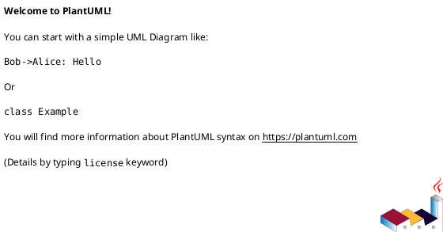

### File Extension
Save your diagrams with `.puml` extension.

## Core UML Diagrams

### Class Diagrams

Class diagrams show the structure of your system's classes, their attributes, methods, and relationships.

#### Basic Syntax
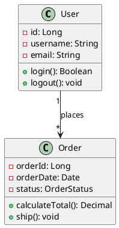

#### Relationships
- **Association**: `--`
- **Inheritance**: `--|>`
- **Implementation**: `..|>`
- **Dependency**: `..>`
- **Aggregation**: `o--`
- **Composition**: `*--`

#### Visibility Modifiers
- `+` Public
- `-` Private
- `#` Protected
- `~` Package

#### Advanced Example
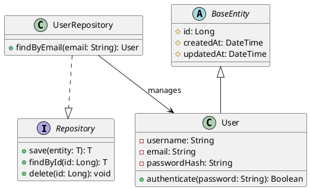

### Sequence Diagrams

Sequence diagrams illustrate interactions between objects over time, perfect for documenting API flows and system interactions.

#### Basic Syntax
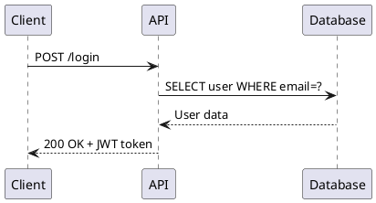

#### Message Types
- **Synchronous**: `->`
- **Asynchronous**: `->>`
- **Return**: `-->`
- **Self-call**: `->` (to same participant)

#### Advanced Features
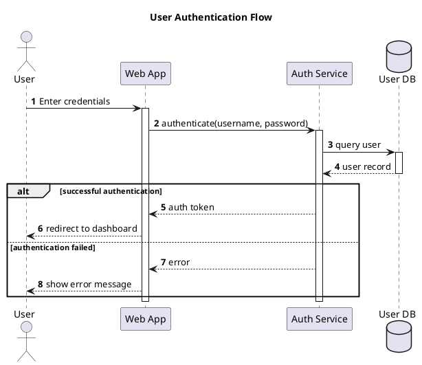

### Component Diagrams

Component diagrams show how components are wired together to form larger systems.

#### Basic Syntax
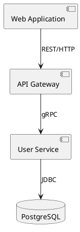

#### With Interfaces
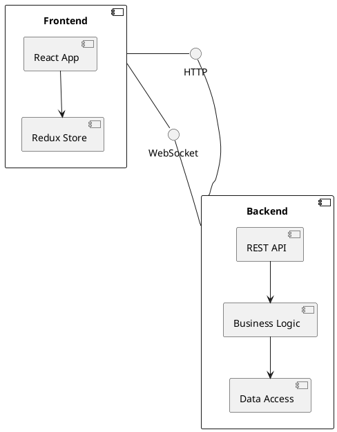

### Use Case Diagrams

Use case diagrams show interactions between users (actors) and system functionality.

#### Basic Syntax
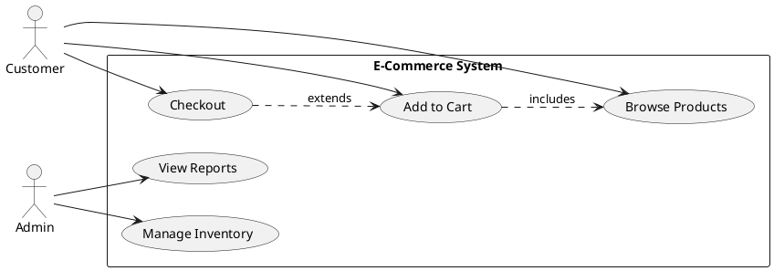

### Activity Diagrams

Activity diagrams model workflows and business processes.

#### Modern Syntax (Beta)
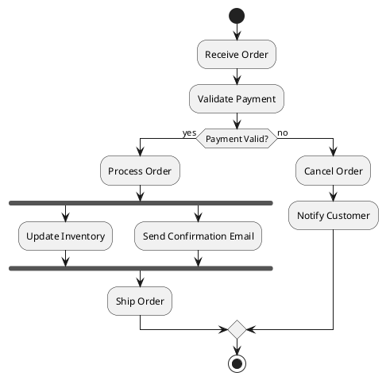

### State Machine Diagrams

State diagrams show the different states an object can be in and transitions between them.

#### Basic Syntax
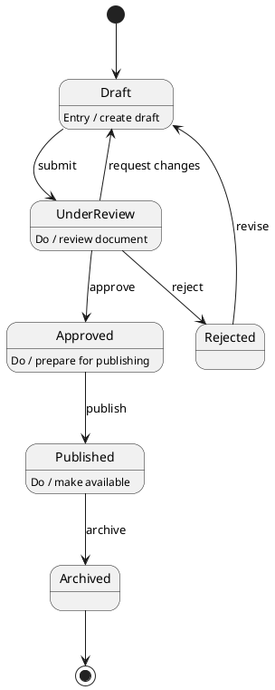

### Deployment Diagrams

Deployment diagrams show the physical deployment of artifacts on nodes.

#### Basic Syntax
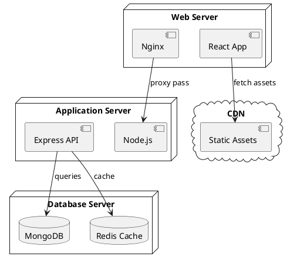

## Architecture Diagrams

### C4 Model Diagrams

The C4 model provides a hierarchical way to describe software architecture at different levels of detail.

#### Setup
Include the C4-PlantUML library:
```plantuml
!include https://raw.githubusercontent.com/plantuml-stdlib/C4-PlantUML/master/C4_Context.puml
```

#### Level 1: System Context
```plantuml
@startuml
!include https://raw.githubusercontent.com/plantuml-stdlib/C4-PlantUML/master/C4_Context.puml

Person(customer, "Customer", "A customer of the bank")
System(banking_system, "Internet Banking System", "Allows customers to manage accounts")
System_Ext(email_system, "E-mail System", "The internal email system")
System_Ext(mainframe, "Mainframe Banking System", "Core banking system")

customer --> banking_system : Uses
banking_system --> email_system : Sends emails
banking_system --> mainframe : Gets account data
@enduml
```

#### Level 2: Container Diagram
```plantuml
@startuml
!include https://raw.githubusercontent.com/plantuml-stdlib/C4-PlantUML/master/C4_Container.puml

Person(customer, "Customer", "Banking customer")

System_Boundary(c1, "Internet Banking") {
    Container(web_app, "Web Application", "React", "Provides banking UI")
    Container(api, "API Application", "Node.js", "Provides banking API")
    Container(database, "Database", "PostgreSQL", "Stores user and account data")
    Container(mobile_app, "Mobile App", "React Native", "Mobile banking interface")
}

System_Ext(email, "Email System", "SendGrid")
System_Ext(banking, "Core Banking", "Mainframe")

customer --> web_app : Uses [HTTPS]
customer --> mobile_app : Uses
web_app --> api : Makes API calls [JSON/HTTPS]
mobile_app --> api : Makes API calls [JSON/HTTPS]
api --> database : Reads/Writes [SQL]
api --> email : Sends emails [SMTP]
api --> banking : Gets account data [XML/HTTPS]
@enduml
```

#### Level 3: Component Diagram
```plantuml
@startuml
!include https://raw.githubusercontent.com/plantuml-stdlib/C4-PlantUML/master/C4_Component.puml

Container(spa, "Single-Page App", "React", "Banking UI")
Container(api, "API Gateway", "Kong", "API management")

Container_Boundary(api_app, "API Application") {
    Component(auth, "Authentication", "JWT", "Handles user authentication")
    Component(accounts, "Account Service", "Node.js", "Account management")
    Component(transactions, "Transaction Service", "Node.js", "Transaction processing")
    Component(notifications, "Notification Service", "Node.js", "Send notifications")
}

Container(db, "Database", "PostgreSQL", "Application data")
System_Ext(email, "Email System", "External email service")
System_Ext(core, "Core Banking", "Legacy system")

spa --> api : API calls
api --> auth : Routes requests
auth --> db : User data
accounts --> db : Account data
accounts --> core : Sync accounts
transactions --> db : Store transactions
transactions --> core : Process transactions
notifications --> email : Send emails
@enduml
```

### Entity Relationship Diagrams

ER diagrams model database structures and relationships.

#### Basic Syntax
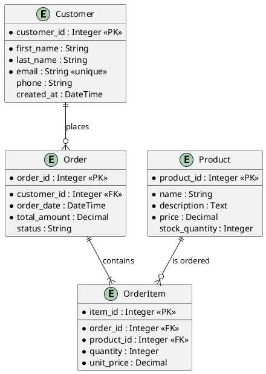

## Advanced Features

### Styling and Themes

#### Using Skinparam
```plantuml
@startuml
skinparam backgroundColor #EEEEEE
skinparam class {
    BackgroundColor #FFFFFF
    BorderColor #000000
    ArrowColor #000000
    FontName Arial
    FontSize 12
}

skinparam sequence {
    ParticipantBackgroundColor #F0F0F0
    ParticipantBorderColor #888888
    LifeLineBorderColor #0000FF
    ArrowColor #000000
}

class Example {
  +method()
}
@enduml
```

#### Using Themes
```plantuml
@startuml
!theme plain
' or !theme aws-orange, blueprint, etc.

class MyClass {
  +myMethod()
}
@enduml
```

### Notes and Comments

#### Adding Notes
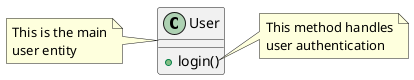

### Grouping and Packaging

#### Using Packages
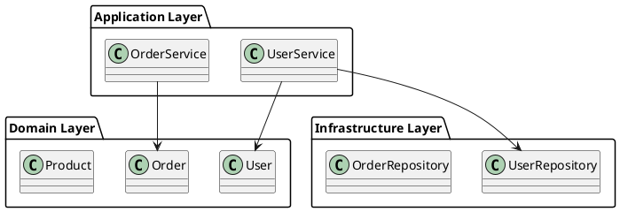

### Directives and Preprocessing

#### Include Files
```plantuml
@startuml
!include common.puml
!include entities/User.puml

User --> Order
@enduml
```

#### Define Constants
```plantuml
@startuml
!define PRIMARY_COLOR #3498db
!define SECONDARY_COLOR #2ecc71

skinparam class {
    BackgroundColor PRIMARY_COLOR
    BorderColor SECONDARY_COLOR
}
@enduml
```

## Best Practices

### 1. Keep Diagrams Focused
- One diagram should convey one main idea
- Split complex systems into multiple focused diagrams
- Use appropriate level of detail for your audience

### 2. Use Consistent Styling
- Define a standard color scheme
- Use consistent naming conventions
- Apply the same layout direction throughout

### 3. Version Control Integration
```bash
# Store diagrams with code
project/
├── src/
├── docs/
│   └── diagrams/
│       ├── architecture.puml
│       ├── database.puml
│       └── sequences/
│           ├── login.puml
│           └── checkout.puml
```

### 4. Documentation
- Add titles and captions to diagrams
- Use notes to explain complex relationships
- Include legends for non-standard symbols

### 5. Maintenance
- Update diagrams when code changes
- Review diagrams during code reviews
- Automate diagram generation in CI/CD

### 6. Performance Tips
- For large diagrams, use `!pragma svgsize none` to remove size limits
- Split very large diagrams into smaller, linked diagrams
- Use includes to reuse common components

### Example: Complete System Architecture
```plantuml
@startuml
!include https://raw.githubusercontent.com/plantuml-stdlib/C4-PlantUML/master/C4_Container.puml

title Container Diagram for Microservices E-Commerce System

Person(customer, "Customer", "End user shopping online")
Person(admin, "Administrator", "System admin")

System_Boundary(system, "E-Commerce Platform") {
    Container(web, "Web Application", "React", "Shopping interface")
    Container(mobile, "Mobile App", "Flutter", "Mobile shopping")
    Container(gateway, "API Gateway", "Kong", "Routes requests")

    Container(auth, "Auth Service", "Node.js", "Authentication & Authorization")
    Container(catalog, "Catalog Service", "Java Spring", "Product management")
    Container(cart, "Cart Service", "Go", "Shopping cart")
    Container(order, "Order Service", "Python FastAPI", "Order processing")
    Container(payment, "Payment Service", "Node.js", "Payment processing")

    ContainerDb(auth_db, "Auth DB", "PostgreSQL", "User credentials")
    ContainerDb(catalog_db, "Catalog DB", "MongoDB", "Product data")
    ContainerDb(order_db, "Order DB", "PostgreSQL", "Order data")
    ContainerQueue(queue, "Message Queue", "RabbitMQ", "Async messaging")
}

System_Ext(payment_gw, "Payment Gateway", "Stripe/PayPal")
System_Ext(shipping, "Shipping Provider", "FedEx/UPS API")
System_Ext(email, "Email Service", "SendGrid")

customer --> web : Browse and shop
customer --> mobile : Browse and shop
admin --> web : Manage system

web --> gateway : API calls
mobile --> gateway : API calls

gateway --> auth : Authenticate
gateway --> catalog : Get products
gateway --> cart : Manage cart
gateway --> order : Place orders
gateway --> payment : Process payments

auth --> auth_db : Store/retrieve users
catalog --> catalog_db : Store/retrieve products
order --> order_db : Store/retrieve orders

order --> queue : Publish events
payment --> queue : Publish events
queue --> email : Send notifications

payment --> payment_gw : Process payments
order --> shipping : Arrange shipping
@enduml
```

## Conclusion

PlantUML provides a powerful, text-based approach to creating software architecture diagrams. By treating diagrams as code, teams can maintain accurate, version-controlled documentation that evolves with their systems. Start with simple diagrams and gradually incorporate more advanced features as your needs grow.

### Resources
- [Official PlantUML Documentation](https://plantuml.com/)
- [PlantUML Language Reference](https://pdf.plantuml.net/PlantUML_Language_Reference_Guide_en.pdf)
- [C4-PlantUML GitHub Repository](https://github.com/plantuml-stdlib/C4-PlantUML)
- [PlantUML Online Editor](http://www.plantuml.com/plantuml/uml/)